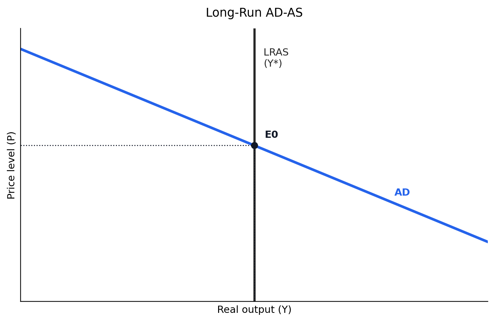
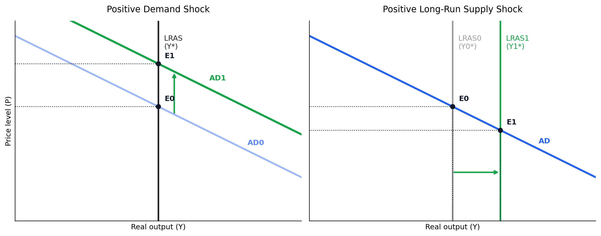
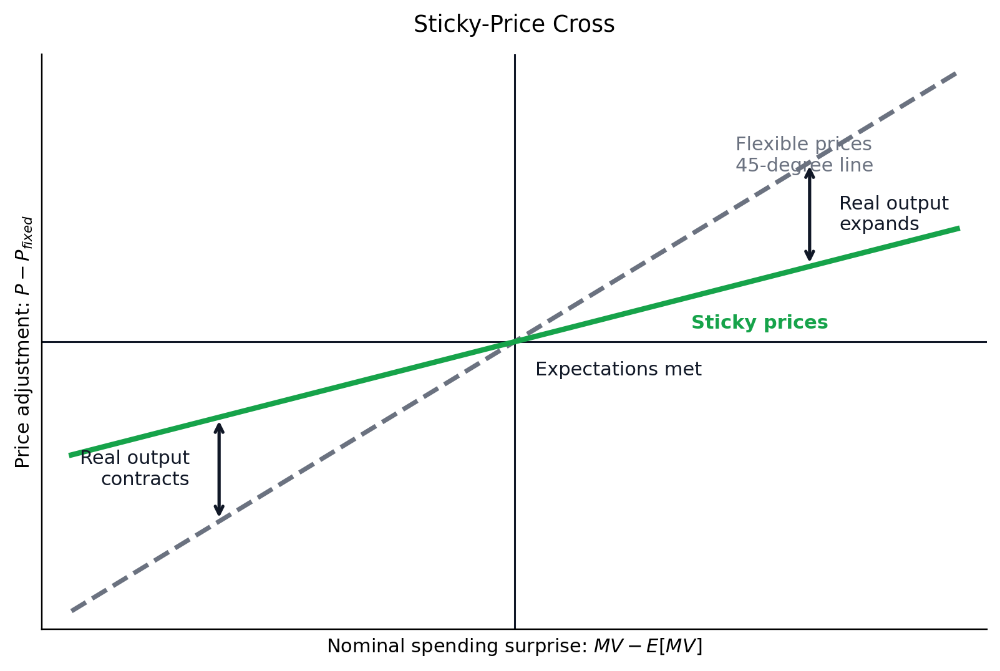
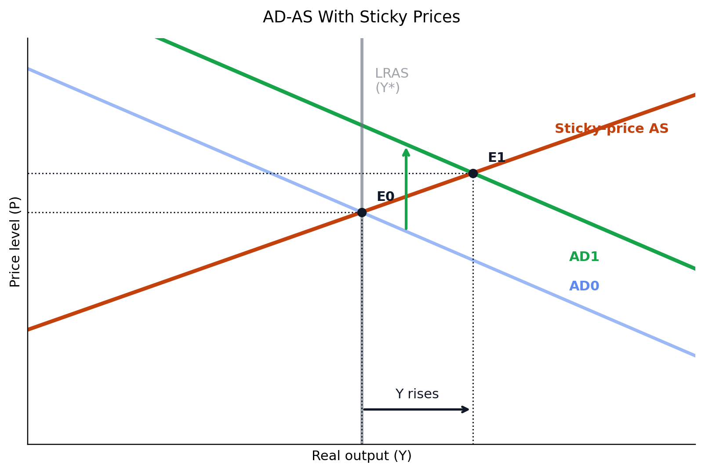
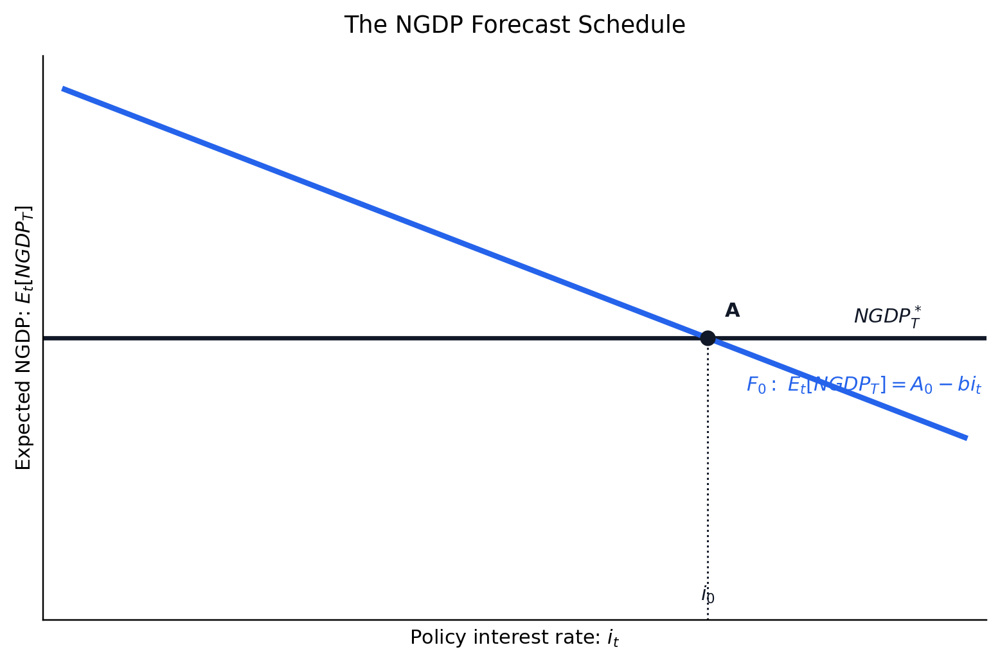
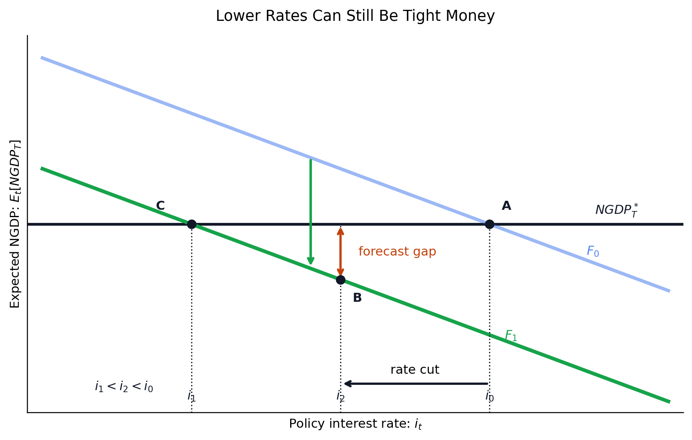
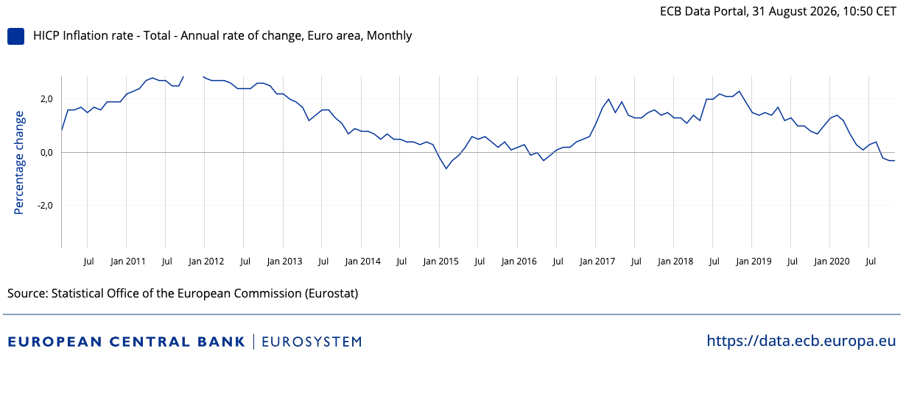
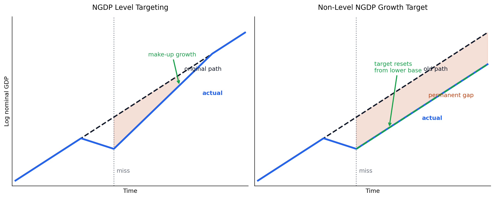

# Market Monetarism

## Introduction

This summer I was reading _The Money Illusion_ by Scott Sumner in an attempt to understand why nominal GDP targeting is becoming an idea that is being thrown around more and more. While I feel I have gotten a better understanding of the idea, I felt the more important insight was the framework of market monetarism and how it approaches business cycle analysis. However, reading the book also left me frustrated that no cleaner derivation of the ideas was presented—one covering both the underlying ideas and assumptions about the world and how the policy implications fit into that model of the world. Concretely, I wanted a presentation of market monetarism in the same way a macro 101 course would go through the ideas of IS-LM. For this reason, to clarify my own understanding and in the hope of better presenting these ideas (and maybe a more pedagogic approach to business cycle economics), I will in this blog try to graphically derive the framework. Concretely, I will start by showing the macroeconomic framework and after that go through the actual policies recommended.

**ADD ONE-PARAGRAPH ROADMAP HERE**

## Two Important Identities

So business cycle economics asks how nominal and real variables interact. To begin, let me introduce two identities (things that by definition are true) and show how they are related. The first one is the *GDP expenditure identity*. I.e., the total GDP of a country can be broken into consumption (C), investment (I), government spending (G), and net exports (NX). This relationship has usually been relevant for business cycle questions because it naturally begs the question of whether government spending could counteract private consumption (short-run) spending slumps.

$ Y = C + I + G + NX $

This is really a statement about the _real_ economy, i.e., nominal entities such as prices are not present in this relationship. It's only about how the actual production of society can be broken into subcomponents. The second important identity (which is usually only introduced much later in a macro course) is the *equation of exchange*. This is about how the real economy is associated with the _nominal_ entities in the economy, such as prices and interest rates. While the first one is usually pretty intuitive, the second one was not as obvious to me. It states that the money supply (M) times the velocity of money (V) must equal the price level (P) times real GDP (Y).

$ M*V = P*Y $

Here the distinction between real GDP (Y) and nominal GDP (P*Y) is whether or not we account for the price level. The nominal GDP (right-hand side) of the identity never stood out to me as weird; however, (M * V) always did. I had some idea about the money supply being the amount of money in society, but the velocity of money seemed to be super confusing. But really, if one instead thinks about it like this: Nominal GDP must be equal to all the exchanges that have happened using money, so by definition, money must have been used (on average) V times. I.e., if the total activity (P * Y) is 1 billion dollars and the money supply is 100 million dollars, then for this activity to have happened, each dollar must have been used 10 times, i.e., the velocity would be 10. I think velocity is the strangest concept to get used to, but it has important implications because velocity is often assumed to be somewhat constant, but this might actually not be true in the case of a big shock to the economy. When the COVID pandemic hit in 2020, you might easily imagine the velocity changing due to the strange environment everyone found themselves in. Note that going forward, it will be useful to think about this identity using a logarithmic transformation, which makes plotting easier since it turns products into sums.

After having introduced the two identities we will be using in the rest of this blog, let us first think about the difference between the long and short run in economics. This idea is usually referred to as the _classical dichotomy_. The money supply and price level, i.e., _the nominal entities_, do not impact employment, real output, etc., i.e., _the real entities_, in the long run. If you consider the thought experiment of doubling the total amount of money, we would not magically imagine that more things would be able to be produced. The real economy is about factories, products and services, and the people who make them happen. Money is just a way to exchange goods and services, as well as store value. However, as we will see in this blog, in the short run, things get more complicated.

## AD-AS in the Long Run

Since economists think in terms of supply and demand, aggregate demand (AD) and aggregate supply (AS) are a natural way to think about activity in the macroeconomy. However, aggregate demand and aggregate supply, even though these are commonly used terms, are a bit of a misnomer. But to begin with, let's consider the AD-AS diagram for the long run.

*Figure 1: The baseline long-run AD-AS diagram. AD slopes down, while long-run AS is vertical at potential output.*

Since nominal variables have no impact on real output, the supply curve is just a vertical line at the quantity actually produced. What about demand? This is even stranger since demand is usually a statement about multiple goods. I.e., if apples get expensive, I substitute toward alternatives (bananas). In macro, substitution is not as obvious. Instead, we can think about this slightly differently. Assume the central bank fixes the money supply and velocity is somewhat fixed. Then we know (P*Y) must be constant. So instead, the demand curve can be understood as the price level for a given output level (Y).

Before moving on to the strange case of an upward-sloping supply curve, let's familiarize ourselves with the long-run AD-AS diagram and consider two shocks: a demand shock (left-hand side) and a supply shock (right-hand side), below.

*Figure 2: On the left, a positive demand shock shifts AD right and raises the price level without changing long-run output. On the right, a positive supply shock shifts LRAS right, raising long-run output and lowering the price level.*

First, we see that a demand shock, with constant Y, shifts the downward-sloping aggregate demand curve upwards. The equilibrium output stays unchanged; however, the price level increases. And if we move back to the _equation of exchange_, we see that if P increases and Y stays constant, either the money supply, the velocity, or some combination must have changed.

Moving on to an even stranger example, consider the positive supply shock's impact on the price level. As we would expect from normal supply and demand analysis, we see that a rightward-shifted supply curve yields a lower price level (P). While this seems at first totally in line with standard demand and supply theory, consider how this contrasts with how we usually talk about the economy. Usually, a hot economy and high growth rates are associated with high inflation. Yet what the diagram above shows is the exact opposite: growth is deflationary! I had not internalized this insight before reading _The Money Illusion_, and actually, I think this is a point not emphasized in traditional economics education.

Now, in some sense, if the insight of long-run AD-AS thinking is that the real economy is not impacted by nominal variables, should monetary policy even have any stabilizing properties? Really, no, but as also highlighted, we in fact see a positive correlation between nominal variables such as inflation and growth, while the vertical (long-run) aggregate supply curve would predict the opposite. For this reason, it makes sense to try to formulate a convincing theory of how nominal entities can impact the real economy.

## Getting to an upward-sloping aggregate supply curve

The theory Scott Sumner proposes (and the one most New Keynesians would accept) is that price stickiness / price rigidities, especially in the labor market, can impact the real economy. Scott Sumner describes this as the _musical chairs_ model. Imagine wage contracts are set once each year. I.e., each employee is promised a fixed wage. Yet all of a sudden, a monetary contraction happens. Either M or V decreases. Then the total stock of money allocated for wages decreases, which, again, makes firms unable to pay the promised wages. If wages were flexible, this would just imply a fall in wages, but since they are fixed, it will require firms to reduce their stock of workers, i.e., fire people, and firing people has a real impact on the economy. Employment is, after all, an essential part of producing real stuff.

Wages are fixed at the level they are because of expectations. When workers and firms agree on a wage, they are implicitly betting on how much nominal spending there will be over the coming year. If the central bank announced that everything would soon cost twice as much, workers would demand twice the wage. What matters is not the number of dollars on the paycheck, but what those dollars are expected to be worth.

Problems arise when spending comes in different from what was expected. Figure 3 shows this. The horizontal axis is the spending surprise: how far actual nominal spending lands from what people expected. The vertical axis is how much prices move in response. If all prices were flexible, they would absorb the entire surprise one-for-one. That is the dashed 45-degree line, and in that case real output doesn't change at all. With sticky prices, prices move less than the surprise (the green line). Since nominal spending is just prices times output, whatever prices don't absorb has to show up in real output.

*Figure 3: A sticky-price cross. With fully flexible prices, nominal spending surprises are absorbed by prices along the 45-degree line. With sticky prices, prices move less than one-for-one, so the remaining adjustment shows up as real output expanding or contracting.*

How sticky prices are determines how steep the green line is. Very sticky prices mean nominal surprises mostly move output. Very flexible prices mean they mostly move prices. In the limit of perfectly flexible prices, we are back to the vertical long-run supply curve from earlier.

Carried over to the AD-AS diagram, this gives the upward-sloping supply curve. Each possible level of nominal spending produces a different combination of price level and output, and together these trace out a curve that passes through the point where expectations are exactly met.

*Figure 4: The same logic drawn as an AD-AS diagram. Sticky prices turn AS into an upward-sloping curve, so a positive nominal spending shock shifts AD right and moves the economy from E0 to E1. Both the price level and real output rise relative to the expected point.*

Here, I should add that thinking of price stickiness as a rigidity is inherently not a monetarist (or market monetarist) idea. This is accepted in Keynesian models. But what generally makes the above stand out is the explicit focus on the equation of exchange. Interestingly, the focus on price rigidities makes market monetarism, in this instance, diverge from classical right-of-center thinking. An upward-sloping aggregate supply curve is usually associated with Keynesianism, whereas right-wing economics would usually blame business cycles on real shocks to the economy.

## Policy Implications

So I would summarize the view of the market monetarist as such:

1. A belief in upward-sloping aggregate supply curves.
2. Take the equation of exchange seriously, and use it as a starting point for monetary policy.
3. Level targeting. Missing a target implies you make up for it. This allows central banks to pursue expansionary monetary policy more credibly (and the opposite).
4. Use market forecasts as the single best predictor of the stance on whether monetary policy is too tight or too expansionary.

Now, traditionally, price stability is an important feature of central banking; in the eurozone, it's actually the only one. Concretely, price stability in this instance can be translated to inflation targeting. The European Central Bank has a single goal: to keep inflation at 2% each year. In recent years, the instruments used to achieve this goal have expanded, but traditionally, monetary policy has been conducted through a single instrument, namely setting the (short-term) interest rate.

**ADD SHORT EXPLANATION OF POLICY INSTRUMENTS HERE**

But here we see that market monetarism is still thinking of using interest rates as the primary policy lever (at least as I understand it), but instead of targeting inflation, it targets nominal GDP, usually at a growth rate of approximately 4% each year. If we again think of $P * Y$ as the expression of nominal GDP and think of 2% real growth (on average) each year, this roughly corresponds to 2% inflation each year. So price stability is still achieved using nominal GDP targeting. But still, you get a tradeoff directly baked in, in the sense that a lower real growth rate will be accommodated by more expansionary monetary policy, primarily through expanding the money supply M (or lowering the interest rate), until the nominal GDP target is achieved. And again, all this reasoning stems from the equation of exchange.

## Never reasoning from a price change

I think market monetarism, as a framework, is also associated with a set of criticisms of reasoning about the stance of monetary policy by looking at interest rates. Concretely, even though interest rates fell during and after the financial crisis in 2008, Scott Sumner argues (and I believe quite convincingly) that monetary policy was actually tight. Again, just because interest rates fell, monetary policy can still be too tight, and aggregate nominal GDP is the best way to see it. The figure below illustrates this. Even though I might bastardize the market monetarist framework a little here by implying that the interest rate is the primary tool of monetary policy, it helps explain the dictum _never reason from a price change_. In the figure below, the black horizontal line represents the nominal GDP target, while the blue downward-sloping line is nominal GDP as a function of the interest rate. Point A is where the interest rate would yield nominal GDP according to the target. A lower interest rate would yield a higher nominal GDP, whereas a higher interest rate would yield a lower nominal GDP, hence the negative relationship.

*Figure 5: A single NGDP forecast schedule. At point A, the policy interest rate $i_0$ is consistent with expected nominal GDP hitting the target $NGDP_T^*$.*

Now say some shock to the economy pushes the "demand" down (green line), implying that the initial interest rate would yield an economy below the nominal GDP target, and for this reason, the central bank lowers the interest rate to point B. In other words, we see that on the surface monetary policy has loosened, but again, never reason from a price change, because the economy will still be below the target. And whether monetary policy is tight or loose enough is entirely determined by whether the central bank is hitting its target. And for this to happen, the central bank would have to lower its interest rate even more, to point C.

*Figure 6: A lower interest rate does not necessarily imply easier monetary policy. After a contractionary shift in the NGDP forecast schedule, the central bank may lower the policy rate while still leaving expected nominal GDP below target. Monetary policy should therefore be judged by the expected path of nominal spending, not by the level or change of the interest rate alone.*

A lot of Scott Sumner's criticism is exactly about this: during the Great Recession in 2008, central banks did not ease monetary policy further, even though they were below their inflation targets. Reading _The Money Illusion_ has made me think of the now-famous quote by then-ECB president Mario Draghi, when there was a genuine fear of fragmentation of the euro due to rising interest rates in southern Europe:

> Within our mandate, the ECB is ready to do whatever it takes to preserve the euro. Believe me, it will be enough.

Really, I think one takeaway for a central bank not hitting its target (whether inflation or nominal GDP) should be to communicate the belief that _it will be enough_, which, by the way, was not achieved by the ECB under Mario Draghi.

## (Nominal GDP) Level targeting

Up until now, we have assumed the central bank is able to hit its target. As we know, central banks often struggle with this exact point. And traditionally, targeting has implied letting _bygones be bygones_, i.e., missing a target does not imply that we make up for it.

And as we see, the inflation rate is, for long stretches, well below 2 percent, which is what the ECB is targeting. Again, as shown earlier, expectations are really key for economic activity, and for this reason, starting all over in setting expectations by not trying to make up for lost ground is very central to market monetarism. If the central bank can more credibly communicate that if we are below the target this year, we will be using even more drastic measures next year, market participants will be much more aware of how expansionary monetary policy will be. Also, I believe that, even though it is not stated explicitly, many of the economic indicators used by market participants will be much more useful when switching to nominal GDP. I.e., real output, unemployment, etc. will be more explicitly part of the central bank target.

**ADD CLEARER DISTINCTION BETWEEN NGDP GROWTH TARGETING AND NGDP LEVEL TARGETING HERE**

This attitude of making up for lost ground can be shown by:

*Figure 7: NGDP level targeting versus a non-level target. The y-axis is log nominal GDP. On the left, a miss below the target path requires faster future growth until the original path is regained. On the right, the central bank resumes the old growth rate from the lower base, so the shortfall becomes permanent.*

## A Futures Market for the Nominal GDP Target

Now, if looking at interest rates and using internal central bank forecasts of inflation is an inadequate way to make claims about whether monetary policy is too easy or too tight, how should it then be governed? The market monetarist idea is to create a futures market. The central bank would conduct policy based on whether or not the futures align with the nominal GDP target. If the futures market suggests nominal GDP will be below target, the central bank should ease monetary policy, and on the other hand, if nominal GDP is above target, it should tighten it. It should be noted, however, that this has some theoretical issues that have made Scott Sumner revise this idea.

# Summarizing

I have here tried to outline what I believe to be the core ideas of market monetarism, communicated through the kind of tools you would expect in an introduction to macroeconomics. I have, of course, glossed over some things and even skipped some. That said, I think the main takeaway is this: combining traditionally left-of-center ideas of upward-sloping supply curves with very market-oriented ideas of rational expectations and the efficient market hypothesis and a Friedmanesque focus on the equation of exchange is a very fruitful exercise. Primarily, I think the focus on nominal GDP is a very appealing idea. Nominal GDP targeting delivers price stability and some countercyclical edge to monetary policy, all captured in a single number to target. Additionally, I think removing stabilization from the responsibility of fiscal policy, as I read Scott Sumner, would be a very healthy development. At least, as I read the book, I became more certain that monetary policy probably has more firing power than I believed before reading _The Money Illusion_.

## References

https://www.mercatus.org/research/research-papers/market-driven-nominal-gdp-targeting-regime

https://data.ecb.europa.eu/data/datasets/HICP/HICP.M.U2.N.000000.4D0.ANR
